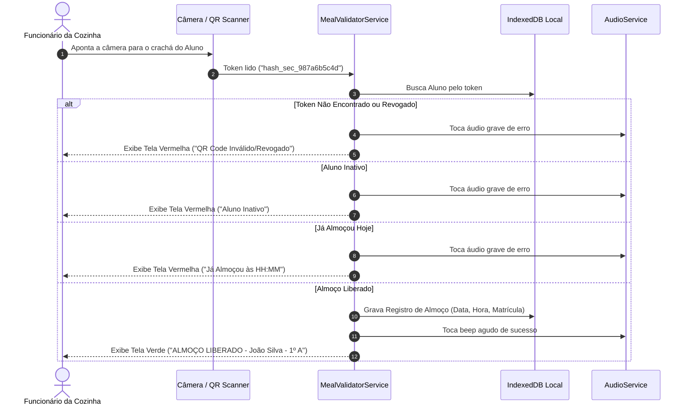

# Documento de Arquitetura e Plano Técnico (Design Spec)
## Sistema de Gestão de Almoço por QR Code - Escola Santos Dumont

---

### 1. Arquitetura Recomendada
Recomenda-se uma arquitetura **PWA (Progressive Web App) Client-First com Motor de Sincronização Local (Offline-First Architecture)**.

```
+-----------------------------------------------------------------------+
|                         NAVEGADOR / PWA CLIENT                        |
|                                                                       |
|  +-------------------+  +-------------------+  +-------------------+  |
|  | Módulo de Leitura |  | Módulo Admin/     |  | Dashboard em      |  |
|  |  QR Code Câmera   |  | Cadastro Alunos   |  | Tempo Real        |  |
|  +---------+---------+  +---------+---------+  +---------+---------+  |
|            |                      |                      |            |
|  +---------v----------------------v----------------------v---------+  |
|  |                    Camada de Serviços (Services)                |  |
|  +--------------------------------+--------------------------------+  |
|                                   |                                   |
|  +--------------------------------v--------------------------------+  |
|  |                    Sync Engine & State Manager                  |  |
|  +----------------+-------------------------------+----------------+  |
|                   |                               |                   |
|  +----------------v---------------+  +------------v----------------+  |
|  | Storage Local (IndexedDB / DB  |  | Service Worker Cache (App   |  |
|  | Offline Resiliente)            |  | Shell Offline Standalone)   |  |
|  +----------------+---------------+  +-----------------------------+  |
+-------------------|---------------------------------------------------+
                    | (Sincronização em background quando online)
                    v
       +----------------------------+
       | Servidor / Storage Central |
       | (JSON / SQLite Storage)    |
       +----------------------------+
```

---

### 2. Tecnologias e Justificativas

| Tecnologia | Função no Sistema | Justificativa de Escolha |
|---|---|---|
| **HTML5 / JavaScript ES6+** | Estrutura e Lógica Principal | Garantia de compatibilidade em qualquer navegador comum e execução ultra-leve em celulares antigos sem overhead de frameworks pesados. |
| **Vanilla CSS3 (Design System)** | Estilização Responsiva & UI | Interface moderna, responsiva, com suporte a cores vibrantes, alto contraste para o refeitório e sem dependências externas pesadas (sem Tailwind/Bootstrap). |
| **Service Worker & IndexedDB** | PWA & Armazenamento Offline | Permite que o sistema funcione 100% offline no celular da cozinha se a internet ou o Wi-Fi da escola caírem. |
| **html5-qrcode / jsQR** | Leitura de QR Code via Câmera | Biblioteca leve e performática para decodificação de QR Code via `getUserMedia` HTML5 diretamente no navegador. |
| **QRCode.js** | Geração Vetorial de QR Code | Geração instantânea de QR Code em canvas/SVG no navegador para visualização e impressão de fichas. |
| **Web Audio API** | Beep de Validação (Feedback) | Gera sons sintéticos de confirmação (beep agudo = sucesso, beep grave duplo = bloqueio) sem precisar carregar arquivos MP3 externos. |
| **JSON / SQLite (WebStorage)** | Banco de Dados Simples | Extremamente fácil de administrar, fazer backup (download de arquivo único JSON/DB) e restaurar pela escola. |

---

### 3. Alternativas Consideradas

1. **Framework React / Next.js / Vue**:
   - *Desvantagem*: Requer etapas complexas de build, maior tamanho de bundle e maior consumo de memória RAM nos celulares antigos da escola.
   - *Decisão*: Optou-se por PWA Vanilla JS altamente modularizado para máxima velocidade e leveza (< 1MB total).
2. **Banco de Dados Relacional Pesado (PostgreSQL/MySQL hospedado na nuvem)**:
   - *Desvantagem*: Dependência obrigatória de conexão de internet de alta qualidade constante (que a escola não possui).
   - *Decisão*: Armazenamento Local-First (IndexedDB) com sincronização em arquivo leve de banco de dados.

---

### 4. Estrutura de Pastas do Projeto

```
Santos Dumont/
├── index.html                   # Ponto de entrada da aplicação Web/PWA
├── requirements.md              # Especificação de Requisitos
├── design.md                    # Plano Técnico e Arquitetura
├── tasks.md                     # Lista de Tarefas de Implementação
├── manifest.json                # Manifesto PWA para instalação
├── sw.js                        # Service Worker para suporte Offline
├── css/
│   ├── main.css                 # Estilos globais e tokens de design
│   ├── components.css           # Estilos de cards, tabelas, botões e alertas
│   ├── scanner.css              # Estilo da tela de leitura e câmera
│   └── dashboard.css            # Estilos de gráficos e indicadores da diretoria
├── js/
│   ├── app.js                   # Inicialização da aplicação e roteamento simples
│   ├── db.js                    # Camada de banco de dados (IndexedDB/Storage)
│   ├── auth.js                  # Controle de login e sessões de usuários
│   ├── scanner.js               # Lógica de controle da câmera e leitura QR
│   ├── audio.js                 # Sintetizador de áudio Web Audio API
│   ├── studentService.js        # Regras de negócio de alunos (CRUD e Tokens)
│   ├── mealService.js           # Regras de validação do almoço e duplicidade
│   ├── qrGenerator.js           # Gerador de QR Code e fichas de impressão
│   ├── dashboard.js             # Lógica e gráficos do dashboard da diretoria
│   └── sync.js                  # Engine de sincronização offline/online
└── assets/
    ├── icons/                   # Ícones da aplicação PWA
    └── img/                     # Imagens e logotipos institucionais
```

---

### 5. Componentes e Responsabilidades

- **AuthManager (`js/auth.js`)**: Gerencia o login de Operador/Diretora e protege rotas administrativas.
- **DatabaseEngine (`js/db.js`)**: Abstrai as operações de gravação e consulta no IndexedDB local com fallback para LocalStorage.
- **QRScannerModule (`js/scanner.js`)**: Gerencia o acesso à câmera via HTML5 `getUserMedia`, decodifica o QR code em tempo real e dispara validações.
- **MealValidatorService (`js/mealService.js`)**: Aplica a Regra de Negócio **RN-001** (máximo 1 refeição/dia), verifica vigência do token de QR Code e grava o registro com timestamp.
- **StudentManagerService (`js/studentService.js`)**: Mantém o cadastro de alunos, busca por nome/matrícula e revogação/reemissão de novos tokens QR.
- **AudioFeedbackService (`js/audio.js`)**: Sintetiza sons instantâneos sem latência na validação.
- **DashboardController (`js/dashboard.js`)**: Calcula e renderiza os gráficos de presença, contadores de refeições do dia e exportações em CSV/PDF.

---

### 6. Modelos de Dados (Schemas)

#### Student (Aluno)
```json
{
  "id": "uuid-string-v4",
  "name": "João da Silva Santos",
  "registration": "202600123",
  "grade": "1º Ano",
  "turma": "Turma A",
  "active": true,
  "qrToken": "hash_sec_987a6b5c4d",
  "createdAt": "2026-07-30T10:00:00Z",
  "updatedAt": "2026-07-30T10:00:00Z"
}
```

#### MealLog (Registro de Almoço)
```json
{
  "id": "meal-uuid-v4",
  "studentId": "uuid-string-v4",
  "studentRegistration": "202600123",
  "studentName": "João da Silva Santos",
  "turma": "Turma A",
  "grade": "1º Ano",
  "date": "2026-07-30",
  "timestamp": "2026-07-30T12:15:30-03:00",
  "qrTokenUsed": "hash_sec_987a6b5c4d",
  "synced": true,
  "validationMethod": "CAMERA" // ou "MANUAL"
}
```

#### User (Usuário do Sistema)
```json
{
  "id": "usr-01",
  "username": "cozinha",
  "role": "OPERATOR", // "OPERATOR" ou "ADMIN"
  "name": "Operador Refeitório"
}
```

---

### 7. Banco de Dados e Armazenamento
- **IndexedDB**: Nome do banco `SantosDumontDB` (Versão 1).
- **Stores**: `students` (KeyPath: `id`, Indexes: `registration`, `qrToken`), `meal_logs` (KeyPath: `id`, Indexes: `date`, `studentRegistration`), `users`.
- **Exportação/Backup**: Funcionalidade nativa na área da diretoria para exportar o banco completo como arquivo `.json` ou restaurá-lo em segundos.

---

### 8. Endpoints / Interfaces do Sistema

Como o sistema é Client-First e offline-resiliente, as interfaces de serviço operam localmente e sincronizam via API REST / Sockets se um servidor backend estiver configurado:

- `POST /api/students` — Cadastra novo aluno.
- `PUT /api/students/:id/reissue-qr` — Revoga token anterior e gera novo QR Code.
- `POST /api/meals/validate` — Recebe `{ qrToken }` ou `{ registration }`, valida e registra a refeição.
- `GET /api/dashboard/today` — Retorna estatísticas de presenças do dia corrente.
- `GET /api/reports/meals?startDate=YYYY-MM-DD&endDate=YYYY-MM-DD&turma=A` — Retorna histórico filtrado.

---

### 9. Fluxos Principais

#### Fluxo 1: Leitura e Validação no Refeitório


---

### 10. Autenticação e Autorização
- Perfis de Acesso:
  1. **Operador (`OPERATOR`)**: Acesso à tela de leitura de QR Code, busca manual e contadores básicos do dia.
  2. **Diretoria / Administração (`ADMIN`)**: Acesso total (Cadastro de Alunos, Reemissão de QR Codes, Dashboard Analítico ao vivo, Relatórios e Backup de Dados).
- Senhas iniciais configuráveis e armazenamento seguro de sessão.

---

### 11. Validação de Dados e Segurança
- **Validação de Matrícula**: Deve conter apenas caracteres alfanuméricos únicos.
- **Sanitização de Entradas**: Prevenção de XSS na busca por nome e cadastro.
- **Opacidade dos Tokens**: O QR Code armazena apenas um hash aleatório GUID/SHA (ex: `sd_token_8f3a1e...`), nunca o nome ou CPF do estudante.

---

### 12. Tratamento de Erros
- **Falha de Câmera**: Captura exceção `NotAllowedError` ou `NotFoundError` e habilita automaticamente a busca manual por Matrícula com teclado numérico em destaque.
- **Instabilidade de Rede**: Captura `fetch error` ou falha de conexão e grava o registro silenciosamente no IndexedDB marcado como `synced: false`, exibindo um indicador visual "Modo Offline Ativo".

---

### 13. Desempenho
- **Tamanho Total dos Ativos (Bundle Size)**: Menos de 1 MB (HTML/CSS/JS compilados e otimizados).
- **Tempo de Leitura**: < 500ms no decodificador local.
- **Frequência de Atualização do Dashboard**: Atualizações reativas a cada nova leitura ou via polling de 5 segundos.

---

### 14. Estratégia de Testes
- **Testes Unitários de Regras de Negócio**: Validar que a função de checagem diária bloqueia corretamente na segunda tentativa no mesmo dia civil.
- **Testes de Integração Offline**: Desconectar o navegador e validar persistência e sincronização posterior.
- **Testes de Usabilidade**: Simular telas com dispositivos móveis de 360px a 1920px de largura.

---

### 15. Estratégia de Implantação
1. Copiar todos os arquivos do projeto para a pasta local `C:\Users\carin\OneDrive\Área de Trabalho\Santos Dumont`.
2. Servir a aplicação através de qualquer servidor local simples (ex: Live Server, `npx serve`, ou servidor HTTP local Node.js/Python).
3. Acessar o IP do computador local através dos celulares do refeitório conectados à rede Wi-Fi da escola.
4. Clicar em "Adicionar à Tela de Início" no celular do refeitório para instalar a aplicação como PWA standalone.
